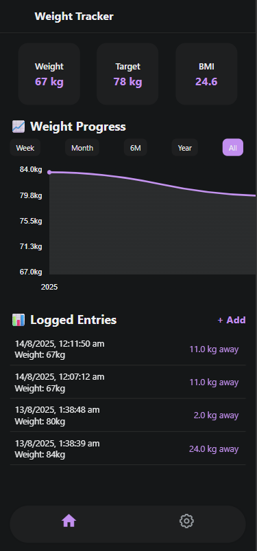
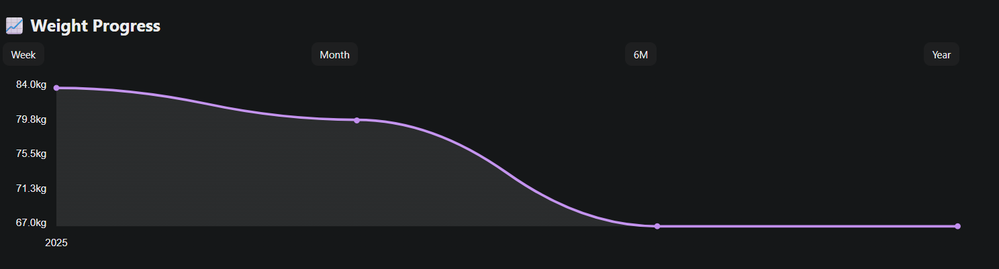
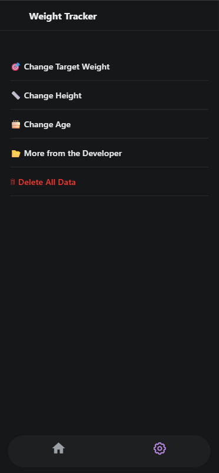

# 📊 KILO — Weight Tracker & BMI Calculator

A sleek and efficient **weight tracker** and **BMI calculator** built with React Native.  
**KILO** helps users monitor their health goals by logging their weight, tracking target goals, and visualizing their progress with an **interactive progress graph**.

---

## 🚀 Features

- 📈 **Interactive Progress Graph** — View your weight trend over time.
- 🎯 **Target Tracking** — Set and update your goal weight anytime.
- 📏 **BMI Calculation** — Automatically calculates BMI for each entry.
- 🕒 **Time Ranges** — Filter graph data by Week, Month, 6 Months, Year, or All time.
- 🗑 **Data Management** — Delete individual entries or clear all saved data.
- ⚙ **Custom Settings** — Update your target weight, height, and age.
- 🎨 **Dark/Light Mode** — Adapts to your device’s theme.
- 📱 **Cross-platform** — Works seamlessly on iOS, Android, and Web.

---

## 📸 Screenshots

| Home Screen                     | Graph View                        | Settings Page                           |
| ------------------------------- | --------------------------------- | --------------------------------------- |
|  |  |  |


---

## 🛠 Tech Stack

- **React Native** — Core framework
- **Expo Router** — Navigation
- **AsyncStorage** — Local data storage
- **react-native-chart-kit** — Graph rendering
- **TypeScript** — Type safety
- **Expo** — Development & deployment

---

## 📦 Installation & Setup

```bash
# Clone the repository
git clone https://github.com/yourusername/kilo.git

# Navigate into the project directory
cd kilo

# Install dependencies
npm install

# Start the development server
npm start
```
